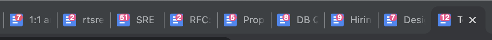

# Google Docs Page Count
Web browser extension to show Google Docs' page count in the tab icon

## Installation

### Chrome
Install as an unpacked extension:
1. Clone or download this repo's [source code](https://github.com/ApsOps/gdoc-page-count/archive/main.zip) and unzip it.
2. Open Chrome's extensions page, at chrome://extensions.
3. Toggle `Developer mode` on, if not on already.
4. Click the `Load unpacked` button, then select the unzipped folder.

## Privacy
This extension does not use any analytics and does not make any external web requests.

## TODO
* Expose configurable options to user settings
